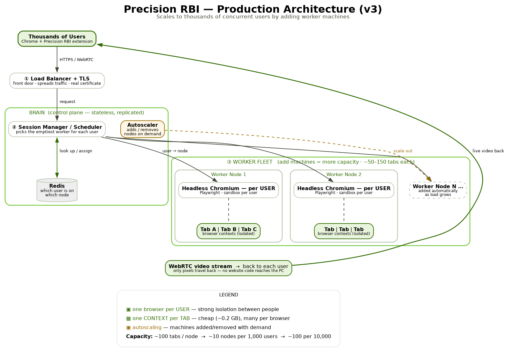
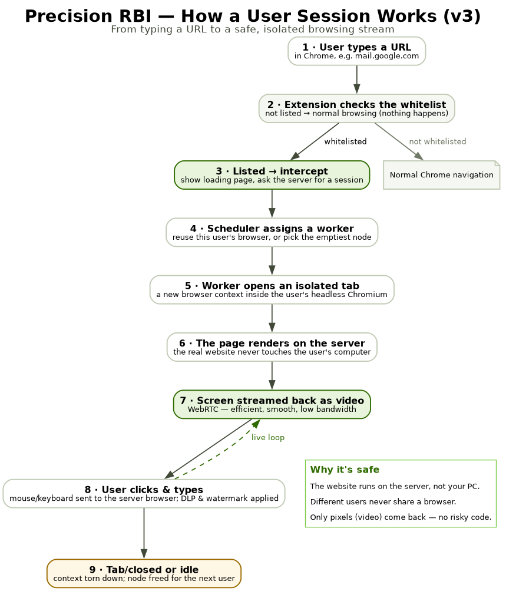

# Precision RBI — v3 Production Architecture (for team leads)

> **One-line summary:** Today's prototype runs one whole browser per tab on one
> machine (good for a demo, ~4 at a time). To serve **thousands of users**, we
> run **many machines** behind a **traffic director**, give **each user one
> browser** (with cheap tabs inside), stream the screen as **video**, and let the
> system **add machines automatically** when it gets busy. This is exactly how
> Cloudflare and Zscaler run browser isolation at scale.

This document is written to be understood by anyone — no deep technical
background needed. Plain explanation first, detail after.

---

## 1. The idea in plain English

Imagine each "safe browsing session" as a place we rent so a user can open risky
websites **away from their own computer**:

- **Today = renting a whole house per tab.** Every browser tab gets its own
  entire house (a full browser + a fake screen). Safe, but expensive — you can
  only afford a few houses on one machine.
- **v3 = one apartment per user, with cheap rooms (tabs) inside.** Each *user*
  gets one apartment (one browser, still fully separated from other users). Each
  *tab* they open is just another **room** inside their apartment — cheap,
  because rooms share the apartment's plumbing.

And to serve a whole city of users, you don't build one giant building — you build
**many apartment blocks** and put a **greeter at the entrance** who sends each
arriving person to a block that has space. When the city gets crowded, you **open
more blocks**; when it's quiet, you **close some** to save money.

> **A common misconception:** people think *Docker* is the heavy part. It isn't.
> Docker is just the lock on the door — cheap. The expensive thing is the
> **browser itself** (and the fake screen it draws on). Swapping Docker for
> something else saves almost nothing. The real savings come from the three
> changes below.

---

## 2. The three changes that make it scale

| # | Change | Plain meaning | Benefit |
|---|--------|---------------|---------|
| 1 | **One browser per user, one context per tab** | An apartment per person; rooms (tabs) are cheap | **3–5× more users per machine** |
| 2 | **Headless browser** (drop the fake screen) | We never look at the fake monitor — we just grab pictures, so remove it | ~30–40% lighter per browser |
| 3 | **WebRTC transport** | Send the screen like a **video call** instead of mailing a photo 30×/sec | ~5–10× less internet + CPU; smooth remotely |

A "context" is the browser's built-in way to keep tabs separated (separate
cookies, logins, cache) — like having several private/incognito windows that
can't see each other.

---

## 3. How it scales to thousands of users

Reading the diagram top to bottom:

1. **Thousands of users** open whitelisted sites in Chrome (with our extension).
2. **① Load Balancer + TLS (the front door)** — receives all traffic securely and
   spreads it out.
3. **② Brain (Session Manager / Scheduler)** — for each user, it asks **Redis**
   "does this person already have a browser somewhere?" If yes, reuse it; if no,
   send them to the **emptiest worker machine**.
4. **③ Worker Fleet** — many machines. Each runs **headless browsers (one per
   user)**, and inside each browser, **one context per tab**. Each machine holds
   roughly **50–150 tabs**.
5. The screen is streamed **back to each user as WebRTC video** — only pixels come
   back, never the website's code.
6. **Autoscaler** — when machines fill up, it **adds more**; when demand drops, it
   **removes** them to save cost.

**The key point for scale:** you grow capacity by **adding machines**, not by
overloading one. That's "horizontal scaling," and it has effectively no ceiling.

---

## 4. The user flow (what happens on one click)

1. User types a URL in Chrome.
2. The extension checks the **whitelist**. Not on it → normal browsing, nothing
   happens.
3. On the list → it **intercepts**, shows a loading page, and asks the server for
   a session.
4. The **scheduler** assigns a worker (reuse the user's existing browser, or pick
   the emptiest machine).
5. The worker opens an **isolated tab** (a new context inside that user's
   headless browser).
6. The real website **renders on the server** — it never touches the user's PC.
7. The screen streams back as **WebRTC video** — efficient and smooth.
8. The user's clicks and typing go to the server browser; **DLP + watermark**
   policies are applied.
9. When the tab closes or goes idle, the context is **torn down** and the machine
   is freed for the next user.

---

## 5. The tech stack, in one line each

| Piece | What it is, simply |
|-------|--------------------|
| **Load Balancer + TLS** | The front door — spreads traffic across machines, with a real security certificate |
| **Session Manager / Scheduler** | The brain — decides which machine serves each user (small, stateless, easy to duplicate) |
| **Redis** | Shared memory — remembers which user is on which machine |
| **Worker nodes** | The machines that actually run the browsers |
| **Headless Chromium + Playwright** | The real web browser (no fake screen), driven by a reliable automation library |
| **Per-user sandbox** (container or microVM) | The wall that keeps one user fully separated from another |
| **WebRTC (+ GPU video encoding)** | Sends the screen as efficient live video |
| **Orchestrator (Kubernetes / Nomad) + Autoscaler** | The manager that runs the fleet and grows/shrinks it automatically |

---

## 6. Will it really handle the numbers? (capacity & cost)

Rule of thumb: **~100 tabs per worker machine** (a decent 16-core / 64 GB node).

| Concurrent users (tabs) | Worker machines needed | Notes |
|------------------------:|------------------------:|-------|
| 100 | ~1–2 | + 1 for safety |
| 1,000 | **~10** | add 1–2 for failover |
| 10,000 | **~100** | same design, more machines |

- **Cost** scales with machine count (~$250–600 / machine / month in the cloud,
  plus GPU machines if using hardware video encoding). You pay for what's running,
  and autoscaling trims idle machines.
- **The real ceiling is usually network bandwidth**, not CPU — which is exactly
  why we switch to WebRTC (it slashes bandwidth) and keep users in the same
  region as the servers for low latency.

So: **yes — thousands of concurrent users is absolutely feasible**, and the design
keeps working unchanged at 10,000+ simply by adding machines.

---

## 7. Is it safe? (the one trade-off to know)

Putting many tabs inside one browser is cheap, but tabs in the **same browser**
share one process — so a serious attack in one room *could* affect rooms in the
**same apartment**. The rule everyone follows removes the risk that matters:

> **Different users never share a browser. Only one user's own tabs share theirs.**

So users stay strongly isolated from **each other**; you only share space with
your own tabs, which are all yours anyway. For extra-strict environments, each
user's sandbox can be a **microVM (Firecracker)** — VM-grade isolation that still
starts in a fraction of a second.

Everything you already have stays: the **whitelist interception**, the
**watermark**, and the **data-loss-prevention (DLP)** controls.

---

## 8. How we get there (phased, low-risk)

| Phase | What we do | Effort | Risk |
|-------|------------|--------|------|
| **1 — Quick win** | Make the current browser **headless** (drop the fake screen) | Small | Low |
| **2 — Proof of concept** | One headless browser hosting **many tabs as contexts**; measure real density on a test box | Medium | Low |
| **3 — Production** | Per-user worker model + **WebRTC** + **scheduler/autoscaler** across a fleet | Larger | Medium |

Today's prototype is a perfectly good **demo/pilot**. This v3 design is the path
when we outgrow it — and each phase is shippable on its own.

---

## 9. Where we are today vs v3

| | Today (prototype) | v3 (production) |
|---|---|---|
| Isolation unit | one container per **tab** | one sandbox per **user** |
| Browser | full Chromium **+ fake screen (Xvfb)** | **headless** Chromium |
| Tabs | each is a whole new container | each is a cheap **context** |
| Screen transport | JPEG photos over WebSocket | **WebRTC** video |
| Machines | one box (~4 sessions) | a **fleet** that autoscales |
| Capacity | ~4 | **thousands** |

---

*Diagrams: `docs/diagrams/rbi-v3-architecture.png` and
`docs/diagrams/rbi-v3-user-flow.png` (editable Graphviz sources `*.dot` alongside).
This document describes a target design; it does not change the running system.*
