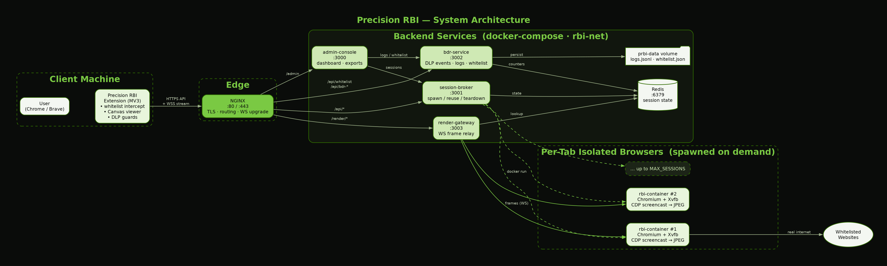
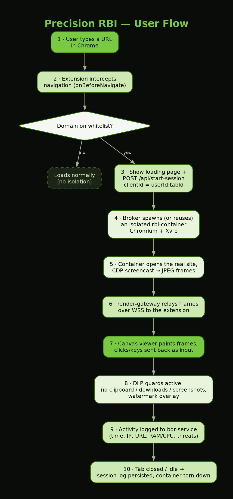
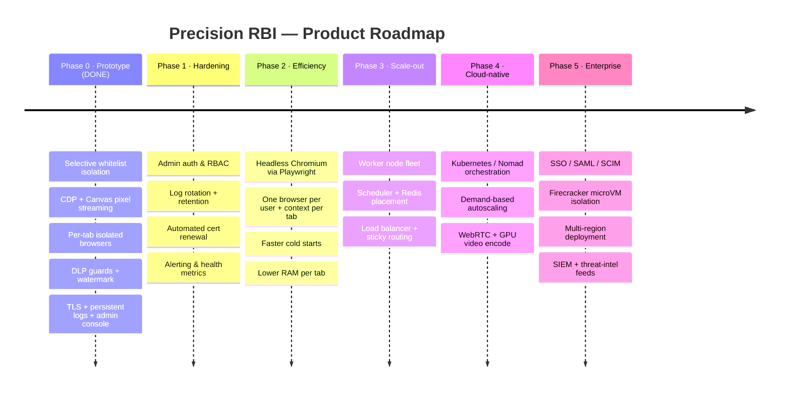

<div align="center">


# 🛡️ Precision RBI

### Selective Remote Browser Isolation — *only pixels reach the user, never the code.*

<p>
  
  
  
  
</p>
<p>
  
  
  
  
  
</p>

<sub>Built by <b>Precision IT</b> · Brand by <b>Luminous Bio-Tech / InnaIT</b></sub>

</div>

---

> **Precision RBI** intercepts navigation to *sensitive* domains and opens them inside a **server-side isolated Chromium container**. The container's screen is captured with the **Chrome DevTools Protocol** (`Page.startScreencast`), streamed to the browser as **JPEG frames over a WebSocket**, and painted on an **HTML5 Canvas**. The site's JavaScript, HTML, and cookies **never touch the user's machine — only pixels do.**
>
> ⛔ **No VNC. No x11vnc. No noVNC.** The same Canvas/CDP pixel-streaming model used by Menlo Security, Ericom Shield, and Zscaler Cloud Browser Isolation. Non-whitelisted sites load normally and are never touched.

---

<div align="center">

### ⬇️ Get the Extension

<a href="https://github.com/Krithiikaa/Precision-RBI-Whitelisted-Domains/raw/main/chrome-extension.zip">
  
</a>

<sub><b><a href="https://github.com/Krithiikaa/Precision-RBI-Whitelisted-Domains/raw/main/chrome-extension.zip">chrome-extension.zip</a></b> · MV3 · ~214 KB &nbsp;•&nbsp; downloads instantly, then load via <code>chrome://extensions → Load unpacked</code> (<a href="#-install-the-chrome-extension">install guide ↓</a>)</sub>

</div>

---

## 📑 Table of Contents

- [✨ Features](#-features)
- [🏗️ Architecture](#️-architecture)
- [🔄 User Flow](#-user-flow)
- [🧰 Tech Stack](#-tech-stack)
- [✅ Prerequisites](#-prerequisites)
- [🚀 Quick Start (from scratch)](#-quick-start-from-scratch)
- [🖥️ Cross-Platform Commands (Windows & Linux)](#️-cross-platform-commands-windows--linux)
- [🔐 Trust the TLS Certificate](#-trust-the-tls-certificate)
- [🧩 Install the Chrome Extension](#-install-the-chrome-extension)
- [📊 Admin Console](#-admin-console)
- [⚙️ Configuration](#️-configuration)
- [📈 Capacity & Scaling](#-capacity--scaling)
- [🗺️ Roadmap](#️-roadmap)
- [🗂️ Project Structure](#️-project-structure)
- [🩺 Troubleshooting](#-troubleshooting)

---

## ✨ Features

| | Feature | What it does |
|:--:|---|---|
| 🎯 | **Selective isolation** | Only whitelisted/sensitive domains are isolated; everything else loads natively at full speed. |
| 🖥️ | **Pixel-only streaming** | CDP `Page.startScreencast` → JPEG over WebSocket → HTML5 Canvas. Zero remote code on the client. |
| 🪟 | **True multi-tab** | Each tab gets its **own** isolated browser (`clientId = userId:tabId`) — tabs never fight over one stream. |
| 🛡️ | **Data-Loss Prevention** | Blocks clipboard, downloads, and screenshots inside isolated sessions + a per-user **watermark** overlay. |
| 🧾 | **Persistent audit logs** | Time, date, device IP, URL, browse time, threats, container RAM/CPU & name — survive restarts. |
| 📤 | **Export anywhere** | One-click export of logs to **CSV / XLS / PDF** from the admin console. |
| 🧮 | **Admin-managed whitelist** | Add/remove domains in the console — changes sync live to every user's extension. |
| ♻️ | **Smart lifecycle** | Spawn-on-demand, reuse-on-reload, teardown-on-close, idle watchdog, startup staggering. |
| 🔐 | **TLS by default** | Self-signed **CA** cert (`CA:TRUE`) with SAN, trusted via NSS — real `https://` end to end. |
| 🌬️ | **Air-gap friendly** | Fonts & dashboard bundled locally — no runtime CDN dependency. |

---

## 🏗️ Architecture

<div align="center">
  
</div>

**At a glance:** the **extension** intercepts navigation → **NGINX** terminates TLS and routes → the **session-broker** spawns a per-tab **isolated Chromium container** → the **render-gateway** relays JPEG frames over WSS back to the Canvas viewer. **Redis** holds live session state; **bdr-service** persists logs & whitelist to a Docker volume; the **admin-console** drives operations.

---

## 🔄 User Flow

<div align="center">
  
</div>

---

## 🧰 Tech Stack

| Layer | Technology | Port | Role |
|---|---|:--:|---|
| **Edge** | NGINX 1.27 | `80/443` | TLS termination, routing, WebSocket upgrade |
| **Control** | Node.js + Dockerode | `3001` | `session-broker` — container lifecycle & session API |
| **Stream** | Node.js + `ws` | `3003` | `render-gateway` — WebSocket frame relay |
| **Telemetry** | Node.js + pdfkit | `3002` | `bdr-service` — DLP events, logs, whitelist |
| **Ops** | React + esbuild + Node | `3000` | `admin-console` — dashboard & exports |
| **State** | Redis 7 | `6379` | Ephemeral session/event store |
| **Isolation** | Debian + Chromium + Xvfb | `7000-7100` | Per-session `precision-rbi-container` (CDP screencast) |
| **Client** | Chrome Extension MV3 | — | Whitelist intercept, Canvas viewer, DLP guards |

---

## ✅ Prerequisites

Tested on **Debian / Ubuntu / Kali (Linux)**. On the target machine you need:

| Requirement | Why | Install (Debian/Ubuntu) |
|---|---|---|
| **Docker Engine 24+** | Runs the stack + per-session browsers | `curl -fsSL https://get.docker.com \| sh` |
| **Docker Compose v2** | Orchestrates services | bundled with Docker Engine (`docker compose`) |
| **OpenSSL** | Generates the TLS cert | `sudo apt install -y openssl` |
| **libnss3-tools** | `certutil` to trust the cert in Chrome | `sudo apt install -y libnss3-tools` |
| **Chrome or Brave** | Loads the extension | — |
| **≥ 8 GB RAM** | Each isolated tab ≈ 1.5 GB | — |

> 💡 After installing Docker, add yourself to the docker group so you don't need `sudo`:
> `sudo usermod -aG docker $USER && newgrp docker`

---

## 🚀 Quick Start (from scratch)

Copy-paste, top to bottom, on a fresh machine. 👇

### 1️⃣ Get the code & enter the backend

```bash
# Copy/clone the project, then:
cd Precision-Whitelist-RBI/backend
```

### 2️⃣ Configure your server IP

```bash
cp .env.example .env

# Find this machine's LAN IP:
hostname -I | awk '{print $1}'

# Edit .env and set SERVER_IP to that IP (clients reach the server at this address):
#   SERVER_IP=192.168.x.x
nano .env
```

### 3️⃣ Create the shared Docker network

```bash
# The compose file uses an EXTERNAL network shared with per-session containers.
docker network create rbi-net
```

### 4️⃣ Generate the TLS certificate

```bash
chmod +x init-certs.sh
./init-certs.sh          # reads SERVER_IP from .env, writes nginx/certs/{server.crt,server.key}
```

### 5️⃣ Build the per-session browser image

```bash
# This image is spawned on demand by the broker (NOT part of compose).
docker build -t precision-rbi-container ./rbi-container
```

### 6️⃣ Launch the stack

```bash
docker compose up -d --build
```

### 7️⃣ Verify everything is healthy

```bash
docker compose ps                                   # all services Up
curl -k https://$(grep ^SERVER_IP .env | cut -d= -f2)/api/health
# → {"status":"ok","version":"2.0.0","activeContainers":0,"maxSessions":4}
```

✅ **Backend is live.** Now trust the cert and install the extension.

---

## 🖥️ Cross-Platform Commands (Windows & Linux)

The **same steps** on both OSes — Linux/macOS and Windows commands sit in **side-by-side columns**, one step per row. The **Where** column tells you the folder/shell to run each command in.

> 🪟 **Windows note:** install **[Docker Desktop](https://www.docker.com/products/docker-desktop/)** (includes Compose) and **[Git for Windows](https://git-scm.com/download/win)** (gives you **Git Bash** + bundled `openssl`). Run the shell script (`init-certs.sh`) inside **Git Bash** or **WSL**. The certificate-trust step differs because Chrome uses the **Windows cert store**, not NSS.

| # | Step | 📍 Where to run | 🐧 Linux / macOS | 🪟 Windows |
|:--:|---|---|---|---|
| 1 | Install Docker | Terminal (admin) | `curl -fsSL https://get.docker.com \| sh` | Install **Docker Desktop** (GUI) |
| 2 | Install tools | Terminal (admin) | `sudo apt install -y openssl libnss3-tools git` | Install **Git for Windows** (bundles Git Bash + OpenSSL) |
| 3 | Enter backend folder | Terminal | `cd Precision-Whitelist-RBI/backend` | `cd Precision-Whitelist-RBI\backend` |
| 4 | Find this machine's IP | Terminal | `hostname -I \| awk '{print $1}'` | `ipconfig` → use the **IPv4 Address** |
| 5 | Create the env file | `backend/` | `cp .env.example .env` | `Copy-Item .env.example .env` |
| 6 | Set `SERVER_IP` in `.env` | `backend/` | `nano .env` | `notepad .env` |
| 7 | Create Docker network | `backend/` | `docker network create rbi-net` | `docker network create rbi-net` |
| 8 | Generate TLS certificate | `backend/` (Win: **Git Bash**) | `chmod +x init-certs.sh && ./init-certs.sh` | `bash init-certs.sh` |
| 9 | Build per-session image | `backend/` | `docker build -t precision-rbi-container ./rbi-container` | `docker build -t precision-rbi-container ./rbi-container` |
| 10 | Launch the stack | `backend/` | `docker compose up -d --build` | `docker compose up -d --build` |
| 11 | Health check | `backend/` | `curl -k https://<SERVER_IP>/api/health` | `curl.exe -k https://<SERVER_IP>/api/health` |
| 12 | **Trust the cert** | `backend/` (Win: **admin** shell) | `certutil -d sql:$HOME/.pki/nssdb -A -t "C,," -n precision-rbi -i nginx/certs/server.crt` | `certutil -addstore -f Root nginx\certs\server.crt` |
| 13 | Restart the browser | — | Fully quit & reopen Chrome | Fully quit & reopen Chrome |
| 14 | Load the extension | `chrome://extensions` | Developer mode → **Load unpacked** → `chrome-extension/` | Developer mode → **Load unpacked** → `chrome-extension\` |
| 15 | Configure & test | Extension **Options** | Server URL `https://<SERVER_IP>` → Save → **Test Connection** | Server URL `https://<SERVER_IP>` → Save → **Test Connection** |

> ⚠️ On Linux, `certutil` comes from **libnss3-tools** (step 2). On Windows, `certutil` is **built into Windows** but is a *different* tool — run step 12 in an **Administrator** PowerShell/CMD so it can write to the Trusted Root store.

#### Everyday management (both OSes)

| Action | Command (run in `backend/`) |
|---|---|
| View service status | `docker compose ps` |
| Tail logs | `docker compose logs -f session-broker` |
| Restart one service | `docker compose restart nginx` |
| Stop the whole stack | `docker compose down` |
| Rebuild after a change | `docker compose up -d --build` |
| Remove a stale session container | `docker rm -f $(docker ps -q --filter "name=rbi-")` |

---

## 🔐 Trust the TLS Certificate

Chrome must trust the self-signed cert, or the extension's `https://` requests fail silently.

```bash
cd backend

# Create the NSS DB if it doesn't exist yet
mkdir -p $HOME/.pki/nssdb && certutil -d sql:$HOME/.pki/nssdb -N --empty-password 2>/dev/null

# Import the cert as a trusted CA
certutil -d sql:$HOME/.pki/nssdb -D -n precision-rbi 2>/dev/null   # remove any stale copy
certutil -d sql:$HOME/.pki/nssdb -A -t "C,," -n precision-rbi -i nginx/certs/server.crt

# Verify it's installed
certutil -d sql:$HOME/.pki/nssdb -L | grep precision-rbi
```

> ⚠️ **Fully quit and reopen Chrome** afterwards — the trust store is read only at startup.
>
> 🔁 If you ever regenerate the cert (`init-certs.sh` again or rebuild), re-run the two `certutil` lines above (delete + add) and restart Chrome — the fingerprint changes each time.

---

## 🧩 Install the Chrome Extension

1. Open `chrome://extensions`
2. Toggle **Developer mode** (top-right) ✅
3. Click **Load unpacked** → select the **`chrome-extension/`** folder
   *(or drag in `chrome-extension.zip`)*
4. Open the extension **Options** and set:
   - **Server URL:** `https://<YOUR_SERVER_IP>`  ← must include `://`
   - ✅ **Enable RBI interception globally**
   - Click **Save**, then **Test Connection** → *Connected · v2.0.0 · 0/4 active* 🎉
5. Browse to a whitelisted site (e.g. `drive.google.com`, `youtube.com`) → it opens **isolated**.

---

## 📊 Admin Console

The operations dashboard runs on the `admin-console` service, behind NGINX:

```
https://<YOUR_SERVER_IP>/admin
```

| Tab | What you get |
|---|---|
| **Dashboard** | Live session count, capacity, system health |
| **Sessions** | Active isolated tabs with device IP, container name, **RAM/CPU** |
| **Logs** | Persistent audit trail — export **CSV · XLS · PDF** |
| **Whitelist** | Add/remove domains → **synced live** to every user's extension |
| **BDR Events** | DLP events (clipboard/download/screenshot blocks, watermark) |
| **System** | Service status & configuration |

Default credentials live in `.env` (`ADMIN_USER` / `ADMIN_PASSWORD`) — **change them before any real deployment.**

---

## ⚙️ Configuration

All tunables live in `backend/.env`:

| Variable | Default | Meaning |
|---|---|---|
| `SERVER_IP` | `10.225.247.38` | LAN IP clients use; cert SAN + `wss://` URL are built from this |
| `MAX_SESSIONS` | `4` | Max concurrent isolated tabs (host-wide) |
| `CONTAINER_MEMORY` | `1.5 GB` | RAM cap per isolated browser |
| `CONTAINER_CPU_QUOTA` | `2.0 cores` | CPU cap per isolated browser |
| `JPEG_QUALITY` | `75` | Stream quality vs. bandwidth |
| `TARGET_FPS` | `30` | Stream frame rate |
| `DISPLAY_WIDTH/HEIGHT` | `1280×720` | Virtual screen size |
| `HEARTBEAT_TIMEOUT_MS` | `30000` | Idle watchdog teardown threshold |
| `FRAME_PORT_MIN/MAX` | `7000–7100` | Internal per-session frame port pool |

---

## 📈 Capacity & Scaling

**Today (prototype):** one isolated **Docker container per tab** (~1.5 GB / up to 2 cores each). On an 8 GB dev box that's **~4 concurrent isolated tabs** (`MAX_SESSIONS=4`) before "at capacity."

**Production (thousands of users):** the heavy part isn't Docker — it's *Chromium + Xvfb per tab*. The v3 design replaces it with **one headless browser per user + one lightweight context per tab**, spread across an **autoscaling fleet** behind a load balancer and scheduler (~100 tabs/node; ~10 nodes per 1,000 tabs).

📖 Full blueprint + diagrams: **[`ARCHITECTURE-v3.md`](ARCHITECTURE-v3.md)** · [`docs/diagrams/rbi-v3-architecture.png`](docs/diagrams/rbi-v3-architecture.png)

---

## 🗺️ Roadmap

From today's working prototype to a multi-region, enterprise-grade isolation cloud.



| Phase | Focus | Key deliverables | Status |
|:--:|---|---|:--:|
| **0** | **Prototype** | Selective isolation · CDP/Canvas streaming · per-tab isolation · DLP · TLS · admin console + exports | ✅ **Done** |
| **1** | **Hardening** | Admin auth & RBAC · log rotation/retention · auto cert renewal · alerting | 🚧 **Next** |
| **2** | **Efficiency** | Headless Chromium (Playwright) · per-user browser + per-tab *context* (replaces per-tab container) · faster cold starts | 🔜 Planned |
| **3** | **Scale-out** | Worker fleet · scheduler + Redis placement · load balancer (~100 tabs/node) | 🔜 Planned |
| **4** | **Cloud-native** | Kubernetes/Nomad · autoscaling · WebRTC + GPU encode transport | 🔜 Planned |
| **5** | **Enterprise** | SSO/SAML · Firecracker microVMs · multi-region · SIEM & threat intel | 🔭 Vision |

📖 The Phase 2–4 architecture is fully designed in **[`ARCHITECTURE-v3.md`](ARCHITECTURE-v3.md)** with diagrams.

---

## 🗂️ Project Structure

```
Precision-Whitelist-RBI/
├── README.md                  ← you are here
├── ARCHITECTURE.md            ← current system deep-dive
├── ARCHITECTURE-v3.md         ← production scaling blueprint
├── chrome-extension/          ← MV3 extension (load unpacked)
│   ├── manifest.json
│   ├── background/            ← service worker: intercept, lifecycle, whitelist sync
│   ├── rbi-viewer/            ← Canvas viewer (paints JPEG frames)
│   ├── loading/ · popup/ · options/ · content/
│   ├── icons/ · fonts/
├── backend/
│   ├── docker-compose.yml     ← nginx · broker · gateway · bdr · admin · redis
│   ├── .env / .env.example    ← configuration
│   ├── init-certs.sh          ← TLS cert generator
│   ├── nginx/                 ← TLS + routing (certs/, nginx.conf)
│   ├── session-broker/        ← container lifecycle (Dockerode)
│   ├── render-gateway/        ← WebSocket frame relay
│   ├── bdr-service/           ← DLP events, logs, whitelist (persistent)
│   ├── admin-console/         ← React dashboard + Node API + exports
│   └── rbi-container/         ← per-session Chromium image (built separately)
└── docs/diagrams/             ← architecture & user-flow PNGs (+ .dot sources)
```

---

## 🩺 Troubleshooting

<table>
<tr><th>Symptom</th><th>Cause & Fix</th></tr>
<tr>
<td><b>“Cannot connect” on Test Connection</b></td>
<td>URL typo (must be <code>https://IP</code> with <code>://</code>), or NGINX not on 80/443. Check <code>docker compose ps</code> and that no other stack holds those ports.</td>
</tr>
<tr>
<td><b>Loading page hangs forever</b></td>
<td>Chrome doesn't trust the served cert. Re-import it (delete + add via <code>certutil</code>) and <b>fully restart Chrome</b>. Confirm fingerprints match:<br><code>echo | openssl s_client -connect IP:443 2>/dev/null | openssl x509 -noout -fingerprint -sha256</code></td>
</tr>
<tr>
<td><b>“At capacity” / 503</b></td>
<td>You hit <code>MAX_SESSIONS</code>. Close isolated tabs or raise the limit in <code>.env</code> (watch RAM: ~1.5 GB/tab).</td>
</tr>
<tr>
<td><b>Port 80/443 already in use</b></td>
<td>Another stack owns them. Only one can. Stop the other, or remap its host ports.</td>
</tr>
<tr>
<td><b><code>network rbi-net not found</code></b></td>
<td>Run <code>docker network create rbi-net</code> before <code>docker compose up</code>.</td>
</tr>
<tr>
<td><b><code>No such image: precision-rbi-container</code></b></td>
<td>Build it: <code>docker build -t precision-rbi-container ./rbi-container</code>.</td>
</tr>
</table>

---

<div align="center">

### 🛡️ Precision RBI

**Selective Remote Browser Isolation** — *threats stay server-side, productivity stays client-side.*

<sub>© Precision IT · Brand: Luminous Bio-Tech / InnaIT · Growth Green <code>#7AC943</code></sub>

</div>
